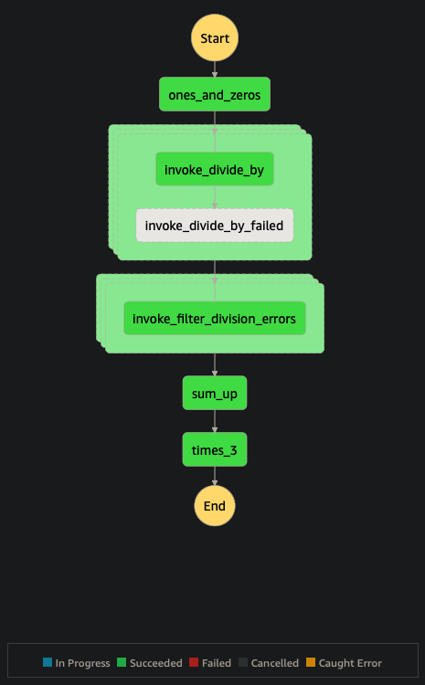

Step Functions state machines halt execution at the first encounter of a failure.

Sometimes, when processing map jobs, you may want all instances of the map job to complete regardless of
an individual failure.

We can accomodate for this by passing `capture_map_errors=True` to our `compose` constructor.

!!! example

    ```python
    from orkestra import compose

    @compose(is_map_job=True, capture_map_errors=True)
    def flaky_map_job(event, context):
        ...
    ```

=== "business logic"

    ```python
    import random
    from typing import *

    from orkestra import compose


    class Error(TypedDict):
        Error: str
        Cause: str


    @compose
    def ones_and_zeros(event, context) -> List[int]:
        return random.choices([0, 1], k=10)


    @compose(is_map_job=True, capture_map_errors=True)
    def divide_by(n: int, context) -> float:
        return 1 / n


    @compose(is_map_job=True)
    def filter_division_errors(event: Union[float, Error], context) -> float:
        return event if isinstance(event, float) else 0.0


    @compose
    def sum_up(numbers: List[float], context):
        return sum(numbers)


    @compose
    def times_3(n: Union[int, float], context) -> Union[int, float]:
        assert isinstance(n, (int, float))
        return n * 3


    ones_and_zeros >> divide_by >> filter_division_errors >> sum_up >> times_3
    ```

=== "Infrastructure As Code"

    ```python
    from aws_cdk import core as cdk

    from examples.map_job import ones_and_zeros


    class MapJob(cdk.Stack):
        def __init__(self, scope, id, **kwargs):

            super().__init__(scope, id, **kwargs)

            ones_and_zeros.schedule(
                self,
                state_machine_name="map_example",
            )
    ```

=== "Unit Tests"

    ```python
    from math import isnan
    from typing import *

    import pytest
    from hypothesis import given, infer, assume
    from hypothesis.strategies import lists, floats

    from examples.map_job import (
        ones_and_zeros,
        divide_by,
        times_3,
        sum_up,
        filter_division_errors,
        Error,
    )


    def test_ones_and_zeros(generic_event, generic_context):
        result = ones_and_zeros(generic_event, generic_context)
        assert len(result) > 5 and isinstance(result, list)
        assert all(n in [0, 1] for n in result)


    def test_divide_by(generic_event, generic_context):
        numbers = ones_and_zeros(generic_event, generic_context)
        for n in numbers:
            if n == 0:
                with pytest.raises(ZeroDivisionError):
                    divide_by(n, generic_context)
            else:
                assert divide_by(n, generic_context)


    @given(n=infer)
    def test_times_3(n: Union[int, float], generic_context):
        assume(not isnan(n))
        assert times_3(n, generic_context) == n * 3


    @given(numbers=lists(floats(min_value=0)))
    def test_sum_up(numbers: List[float], generic_context):
        assert sum_up(numbers, generic_context) == sum(numbers)


    @given(event=infer)
    def test_division_error_filter(event: Union[float, Error], generic_context):
        result = filter_division_errors(event, generic_context)
        if isinstance(event, float):
            assume(not isnan(event))
            assert result == event
        else:
            assert result == 0.0
    ```

=== "State Machine Screenshot"


    
