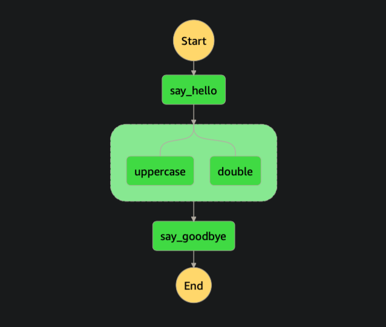

## Creating a new CDK project

In order to use Orkestra, you'll need a CDK project to define your
infrastructure as code (IAC).

```bash
# make sure you have the aws CDK installed

npm install -g aws-cdk

mkdir hello_orkestra

cd hello_orkestra

# this command creates a project scaffold and virtual environment

cdk init -l python
```

You should now have a folder structure like the following

```
❯ tree
.
├── README.md
├── app.py
├── cdk.json
├── hello_orkestra
│   ├── __init__.py
│   └── hello_orkestra_stack.py
├── requirements.txt
├── setup.py
└── source.bat

1 directory, 8 files

```

## Installing Orkestra

Add orkestra to your requirements.

=== "requirements.txt"

    ```
    -e .
    orkestra[cdk]>=0.5.0
    ```

Activate the virtual environment and install Orkestra.

```bash
. .venv/bin/activate

pip install -r requirements.txt
```

!!! warning

    The rest of the tutorial will assume you have the virtual environment activated

!!! note

    You'll notice we installed the cdk optional dependency.

    The cdk dependencies are so we can synthesize our constructs to cloudformation.

## Creating our first workflow

### Scaffolding

Create a folder for your lambdas and populate it with a module
and a requirements.txt that references orkestra as a dependency.

```bash
mkdir lambdas

touch lambdas/main.py

echo "orkestra>=0.5.0" >> lambdas/requirements.txt
```

!!! note

    The packages in requirements.txt file will get installed on the
    lambda.

    Our lambda won't need to build anything with the cdk, so no need for that
    optional dependency.

### Adding Business Logic

Add some functions to our `main.py` module and import the head function (say_hello) in our IAC.

=== "main.py"

    ```python
    from orkestra import compose


    @compose
    def say_hello(event, context):
        return "hello, world"


    @compose
    def uppercase(event: str, context):
        return event.upper()


    @compose
    def double(event, context):
        return event * 2


    @compose
    def say_goodbye(event, context):
        return "goodbye"


    say_hello >> [uppercase, double] >> say_goodbye

    ```

=== "hello_orkestra/hello_orkestra_stack.py"

    ```python
    from aws_cdk import core as cdk
    from lambdas.main import say_hello


    class HelloOrkestraStack(cdk.Stack):
        def __init__(
            self, scope: cdk.Construct, construct_id: str, **kwargs
        ) -> None:
            super().__init__(scope, construct_id, **kwargs)

            say_hello.schedule(
                self,
                expression="rate(5 minutes)",
                state_machine_name="say_hello",
            )
    ```

!!! info

    The `schedule` method of our function takes care of a lot of boilerplate for us.

    Under-the-hood, it...

    1. defines the IAC for our lambda functions
    2. chains them together in a step function state machine
    3. sets that state machine to be triggered by an EventBridge (CloudWatch) event at the interval we set

## Testing

Since Orkestra works by simply decorating normal Python functions,
you are encouraged to compose your business logic in terms of
discrete functions that (hopefully) better lend themselves to
local unit testing.

### Install test requirements

=== "requirements.txt"

    ```
    -e .
    orkestra[cdk,powertools]>=0.5.0
    pytest
    ```

```bash
pip install -r requirements.txt
```

### Create test module

```bash
touch lambdas/test_main.py
```

=== "lambdas/test_main.py"

    ```python
    import pytest

    from main import say_hello, uppercase, double, say_goodbye


    @pytest.fixture
    def event():
        return {}


    @pytest.fixture
    def context():
        return None


    def test_say_hello(event, context):
        assert say_hello(event, context)


    def test_uppercase(event, context):
        event = say_hello(event, context)
        assert uppercase(event, context)


    def test_double(event, context):
        event = say_hello(event, context)
        assert double(event, context)


    def test_goodbye(event, context):
        assert say_goodbye(event, context)
    ```

### Run Tests

```bash
orkestra/hello_orkestra on  main [!?] via 🐍 v3.9.5 (.venv) on ☁️  (us-east-2)
❯ pytest lambdas/test_main.py
=================================== test session starts ====================================
platform darwin -- Python 3.9.5, pytest-6.2.4, py-1.10.0, pluggy-0.13.1
rootdir: ..., configfile: pyproject.toml
collected 4 items

lambdas/test_main.py ....                                                            [100%]

==================================== 4 passed in 0.02s =====================================
```

## Deployment

We're now ready to deploy our workflow to AWS.

The aws cdk cli works similarly to other programmatic AWs clients
in that it will respect environment variables like

* `AWS_PROFILE`
* `AWS_ACCESS_KEY_ID`
* `AWS_SECRET_ACCESS_KEY`

in order know which AWS account to deploy to and to authenticate with AWS.

### Bootstrap

!!! warning

    If this is our first cdk deployment, we will likely need to boostrap it.

    ```
    cdk bootstrap
    ```

!!! note "full boostrapping instructions"
    https://docs.aws.amazon.com/cdk/latest/guide/bootstrapping.html

!!! note "cdk cli api reference"
    https://docs.aws.amazon.com/cdk/latest/guide/cli.html

### Deploy

```bash
cdk deploy
```

!!! success

    🎉 Congratulations 🎉

    You've successfully deployed your first Orkestra project 😃

    
